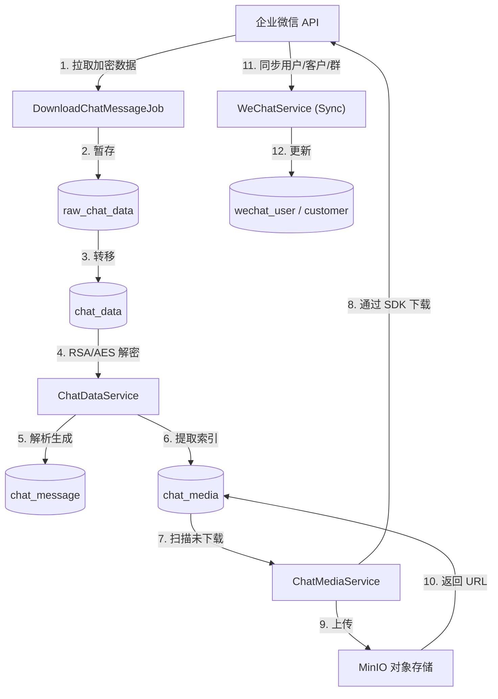

# 企业微信会话存档后端 - 数据流分析 (DATA_FLOW.md)

本文档详细分析了系统中各个关键业务流程的数据流转、变换和存储过程。

## 1. 全局数据流概览

系统数据流主要分为三条主线：
1.  **消息流 (Message Pipeline)**: 负责拉取、解密、解析聊天记录。
2.  **媒体流 (Media Pipeline)**: 负责下载、上传、存储聊天中的图片、文件等资源。
3.  **同步流 (Sync Pipeline)**: 负责维护组织架构、客户信息、群聊信息的最新状态。

---

## 2. 详细数据流分析

### 2.1 消息数据流 (Message Data Flow)

此流程是将企业微信的加密数据转换为业务可用的明文数据的核心。

| 阶段 | 数据状态 | 涉及实体/表 | 关键字段变化 |
| :--- | :--- | :--- | :--- |
| **1. 摄入 (Ingest)** | 加密 JSON | `RawChatData` | `seq` (游标), `encrypt_chat_msg` (密文), `encrypt_random_key` (加密密钥) |
| **2. 流转 (Transfer)** | 加密 JSON | `ChatData` | 同上 |
| **3. 解密 (Decrypt)** | 明文 JSON | `ChatData` | `encrypt_random_key` -> `encrypt_key` `encrypt_chat_msg` -> `chat_msg` (明文) |
| **4. 解析 (Parse)** | 结构化实体 | `ChatMessage` | `msgid`, `msgtype`, `content`, `from_user`, `roomid` |
| **5. 关联 (Relation)** | 关系映射 | `ChatMessageUser` | `msgid`, `from_user`, `to_user` |

#### 代码实现细节

*   **Step 1: 摄入 (Ingest)**
    *   **入口**: `DownloadChatMessageJob.execute()` (定时任务)
    *   **核心类**: `WeChatService`, `WeChatSdkUtil`
    *   **方法**: `WeChatService.getChatData(DownloadChatDataRequest)`
    *   **逻辑**:
        1.  **获取游标**: 判断是手动还是自动模式。自动模式调用 `chatDataService.getMaxSeqFromChatData()` 获取数据库中最大的 `seq`。
        2.  **Native 调用**: 调用 `WeChatSdkUtil.getChatData(sdk, seq, limit, ...)` 从企业微信拉取加密数据。
        3.  **反序列化**: 使用 `ObjectMapper` 将返回的 JSON 转换为 `DownloadChatDataResponse` 对象。
        4.  **存储**: 提取 `RawChatData` 列表，调用 `chatDataService.saveRawChatDatas()` 批量插入 `raw_chat_data` 临时表。
        5.  **循环**: 如果返回的数据条数等于 1000 (接口上限)，则更新 `seq` 并继续循环拉取，直到数据取完。

*   **Step 2: 流转 (Transfer)**
    *   **核心类**: `ChatDataService`
    *   **方法**: `insertRawChatDataIntoChatData()`
    *   **逻辑**: 调用 Mapper 执行 SQL `INSERT INTO chat_data SELECT * FROM raw_chat_data`，将数据从临时表全量迁移至正式表，并默认 `decrypt_flag=0`。这步操作通常在拉取完成后立即执行。

*   **Step 3: 解密 (Decrypt)**
    *   **核心类**: `ChatDataService`, `RSAUtil`, `WeChatSdkUtil`
    *   **方法**: `decryptChatData(long sdk)`
    *   **逻辑**:
        1.  **查询**: `chatDataMapper.selectByDecryptFlag(0)` 获取所有未解密记录。
        2.  **加载私钥**: `RSAUtil.readPrivateKeyFromFile("rsa_private_key.pem")` 读取企业私钥。
        3.  **解密密钥**: 遍历记录，使用 RSA 私钥解密 `encrypt_random_key` 字段，得到 AES 密钥 (`encryptKey`)。
        4.  **解密消息**: 调用 Native 方法 `WeChatSdkUtil.decryptData(sdk, encryptKey, encryptChatMsg)` 解密消息体，得到明文 JSON 字符串。
        5.  **更新**: 将明文存入 `chat_msg` 字段，更新 `decrypt_flag=1`，保存回数据库。

*   **Step 4 & 5: 解析与关联 (Parse & Relation)**
    *   **核心类**: `ChatDataService`, `ChatMessageService`
    *   **方法**: `ChatDataService.generateChatMessage()` -> `ChatMessageService.generateChatMessage(ChatData)`
    *   **逻辑**:
        1.  **查询**: 获取所有 `generate_msg_flag=0` 的 `ChatData` 记录。
        2.  **JSON 解析**: 使用 Jackson 解析 `chat_msg` 字符串。
        3.  **消息构建**:
            *   **Switch 消息**: 识别 `action="switch"`，记录切换企业日志。
            *   **普通消息**: 提取 `from`, `tolist`, `roomid`, `msgtime`, `msgtype` 等通用字段，存入 `chat_message` 表。
        4.  **接收者关联**: 解析 `tolist` JSON 数组，遍历生成 `ChatMessageUser` 记录，用于建立"谁收到了这条消息"的索引。
        5.  **媒体提取**: 根据 `msgtype` (如 `image`, `file`, `mixed`, `chatrecord`) 调用 `parseChatMedia()`。若存在媒体文件，提取 `sdkfileid`, `md5sum` 等信息存入 `chat_media` 表 (状态默认为未下载)。

---

### 2.2 媒体文件流 (Media Asset Flow)

此流程独立于消息流异步运行，处理大文件的传输和存储。

| 阶段 | 数据状态 | 涉及实体/表 | 关键字段变化 |
| :--- | :--- | :--- | :--- |
| **1. 索引生成** | 待下载 | `ChatMedia` | `sdkfileid`, `download_status=0` |
| **2. 下载 (Download)** | 本地临时文件 | File System | `/tmp/uuid.ext` |
| **3. 校验 (Verify)** | 校验通过 | File System | MD5 Check |
| **4. 上传 (Upload)** | 对象存储 | MinIO | Bucket: `enterprise-wechat` |
| **5. 链接更新** | 可访问 | `ChatMedia` | `download_url`, `download_status=1` |

#### 代码实现细节

*   **Step 1: 扫描与下载**
    *   **核心类**: `ChatMediaService`, `WeChatSdkUtil`
    *   **方法**: `downloadMediaDataAndUpload(long sdk)` -> `extracted()`
    *   **逻辑**:
        1.  **查询**: `chatMediaMapper.findByDownloadStatus(0)` 获取未下载任务。
        2.  **路径生成**: 生成本地临时路径，格式为 `/tmp/UUID_时间戳.后缀`。
        3.  **Native 下载**: 调用 `WeChatSdkUtil.downloadMedia(sdk, sdkfileid, ..., localFilePath)` 将文件流写入本地磁盘。若下载失败 (如 `downloadSuccessFlag=false`)，更新状态为 2 并记录错误日志。

*   **Step 2: 校验 (Verify)**
    *   **方法**: `checkFileMD5(String filePath, String expectedMd5)`
    *   **逻辑**: 读取本地文件的输入流，计算 MD5 Hex 字符串，与数据库中的 `md5_sum` 进行比对。如果不一致，标记下载失败。

*   **Step 3 & 4: 上传与更新**
    *   **核心类**: `MinioUtil`
    *   **方法**: `minioUtil.uploadFile(localFilePath)`
    *   **逻辑**:
        1.  **上传**: 调用 MinIO SDK 将本地文件上传至配置的 Bucket。
        2.  **更新**: 获取 MinIO 返回的访问 URL (或 Object Key)，更新 `chat_media` 表的 `download_url` 字段，并将 `download_status` 置为 1。
        3.  **清理**: (代码注释中包含) 删除本地临时文件以释放空间。

---

### 2.3 基础数据同步流 (Master Data Sync Flow)

确保聊天记录中的 ID 能映射到具体的自然人或群组。

#### A. 内部员工同步
*   **入口**: `WeChatService.getWechatUser()`
*   **逻辑细节**:
    1.  **Token**: 检查 Redis 缓存，若无则调用 `getAccessToken` 获取通讯录 Token。
    2.  **ID 列表**: 调用 `getMemberIdList` 获取全量员工 ID。
    3.  **详情获取**: 遍历 ID，调用 `getUserDetail` 获取名称、头像、部门等。
    4.  **存档许可**: 调用 `getPermitUserList` 获取开启了会话存档的员工列表，更新 `SessionArchiveFlag`。
    5.  **差异处理**: `processWechatUsers` 方法对比数据库与 API 数据：
        *   **Insert**: 新 ID 入库。
        *   **Update**: 现有 ID 更新信息。
        *   **Delete**: API 中不存在但库中存在的 ID，标记 `status=-1` (离职)。

#### B. 外部联系人同步
*   **入口**: `WeChatService.getCustomer()`
*   **逻辑细节**:
    1.  **范围**: `wechatUserMapper.getWechatUsersByStatus(1)` 获取所有在职员工。
    2.  **分批**: 将员工 ID 按 100 个一组分批 (`partitionList`)。
    3.  **API 调用**: 遍历批次，调用 `batchGetCustomerDetail` 获取客户详情。
    4.  **数据清洗**: 将返回的 `ExternalContact` 和 `FollowInfo` 映射为 `Customer` 对象。
    5.  **合并策略**:
        *   先清空当日临时表 `raw_customer`。
        *   将新数据批量插入临时表。
        *   执行 SQL 合并：先将正式表相关记录标记失效，再从临时表 `Merge/Insert` 最新状态到 `customer` 表。

#### C. 群聊信息同步
*   **入口**: `WeChatService.getGroupChat()`
*   **逻辑细节**:
    1.  **提取**: `chatMessageService.getDistinctRoomIds()` 从消息表中提取所有去重的 `roomid`。
    2.  **识别**: 遍历 `roomid`：
        *   先调用 `getGroupChatCustomerInfo` (客户群接口)。
        *   若报错，再调用 `getGroupChatInternalInfo` (内部群接口)。
    3.  **更新**:
        *   **群主表**: `GroupChat` (群名、群主、公告)。
        *   **成员表**: `GroupChatMember` (成员列表、入群时间)。
        *   采用"先全量标记失效，再更新活跃数据"的策略保证数据准确性。

---

## 3. 数据消费接口 (API Serving)

前端通过 Controller 层获取聚合后的数据。

- **会话列表**: 
    - 输入: `from_user_id`, `to_user_id` (可选)。
    - 查询: `ChatMessage` JOIN `WechatUser` / `Customer`。
    - 输出: 包含最新一条消息、未读状态等信息的列表。

- **消息详情**:
    - 输入: `roomid` 或 双人 ID 对。
    - 查询: `ChatMessage` 表 (按时间倒序分页)。
    - 输出: 消息流，其中媒体消息包含 `download_url` (指向 MinIO)。

- **媒体下载**:
    - 前端请求 `/api/chatmessage/chatmedia/download?sdkfileid=...`。
    - 后端查询 `ChatMedia` 找到 `download_url`。
    - 后端从 MinIO 下载流 -> 写入 HTTP Response 流 (流式传输，不暴露 MinIO 直接链接)。
